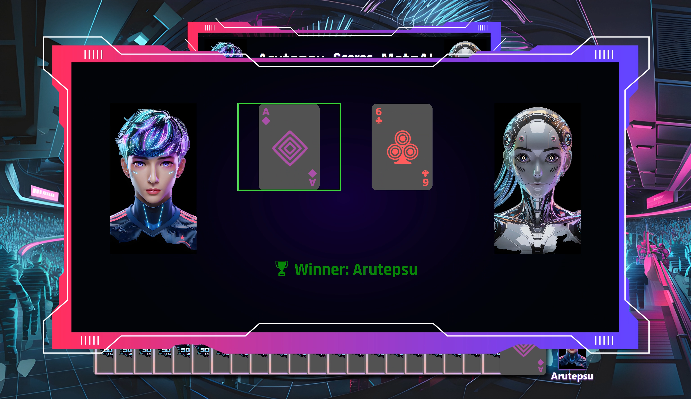

<p align="center">

</p>

---

# Soccer Card Clash

An unofficial web version of the Soccer Card Clash game for Web Application classes at 
Konstanz University of Applied Sciences.

* 🎮 Soccer Card Clash is a fast-paced, strategic 2-player card game where soccer meets tactical mind games.
* 🧠 Outmaneuver your opponent with clever attacks, boosts, and hand manipulation to score goals and win the match.

---

## ⚽ Game Overview
* 🃏 Each player controls a hand of soccer-themed player cards.
* 🔄 Take turns as the attacker or defender.
* 🧠 Outsmart your opponent by choosing the right action at the right time.
* 🎯 Score goals by breaking through all defenders and beating the goalkeeper.

### 📖[Read Full Game Rules](docs/GAMERULES.md)

---

<h2 style="text-align: center;">▶️ Demo Gameplay</h2>
<div style="display: flex; gap: 0px;">
  
  
</div>

---

## 🖥️ Server
This project is built using the Play Framework (Scala).
It provides a simple text-based TUI (Terminal User Interface) that runs on a web page through HTTP requests.

---

## ✨ Features
### 🤖 Singleplayer Mode
Play against various AI opponents, each with its own unique strategy and behavior.

### 🧠 Multiple AI Strategies
Challenge AIs with different difficulty levels and tactics — from cautious defenders to aggressive attackers.

### 🤝 Multiplayer Mode
Play with friends in local multiplayer matches.

### 🎨 Unique Cyberpunk Design
Dive into a cyberpunk-inspired world with bold visuals, neon effects, and a futuristic interface.

### ⚔️ Strategic Gameplay
Mix and match actions like Swap, Boost, and Double Attack to outsmart your opponent.

--- 

## 📸 Screenshots





---

# 🚀 Getting Started
Want to jump into the game? Just clone this repository and launch it locally:

```bash
git clone https://github.com/arutepsu/Soccer-Card-Clash-Web.git
cd soccer-card-clash-web
```
# 🛠️ How to Use
This is a standard sbt project. Here are the most common commands:

### 🔨 Compile the project
```bash
sbt compile
```
### 🎮 Start the game
```bash
sbt run
```
### 🧪 Run tests
```bash
sbt test
```

---

### 📫 Get in Touch
Questions? Feedback? Found a bug?
Feel free to reach out via email: arutepsu@gmail.com
or open an issue right here on GitHub.

Let the Card Clash begin! ⚽🔥⚔️

---