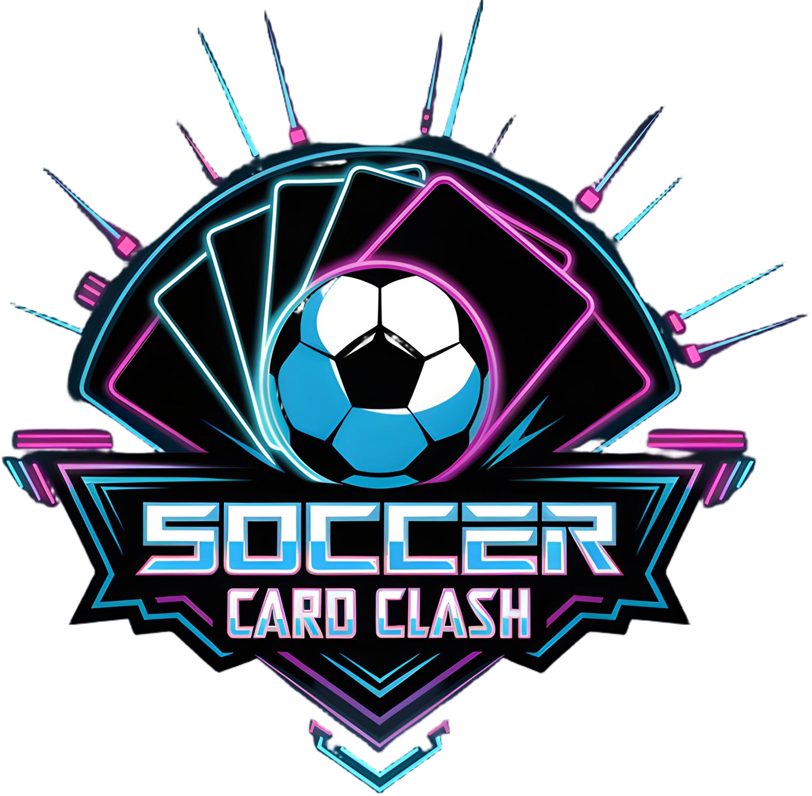
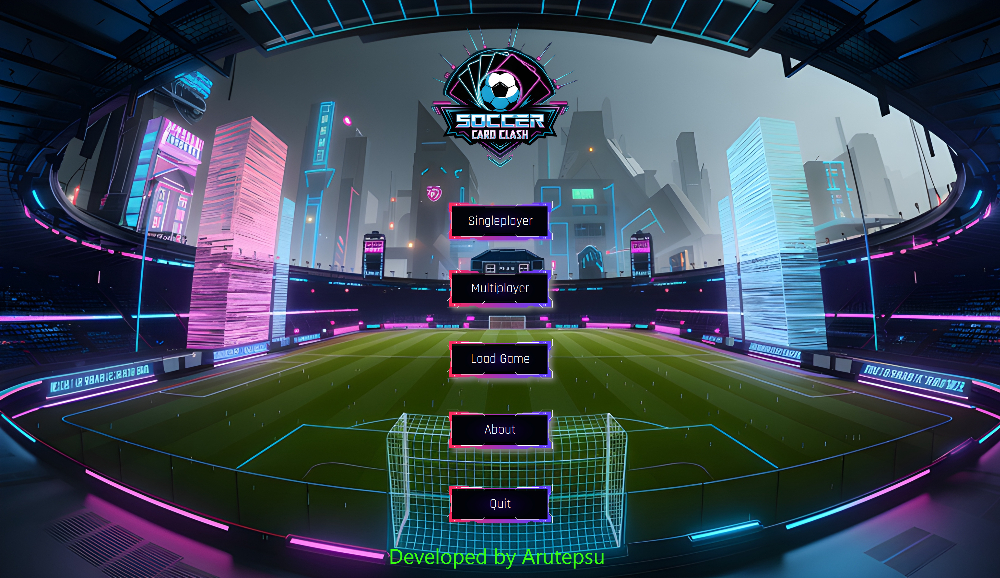
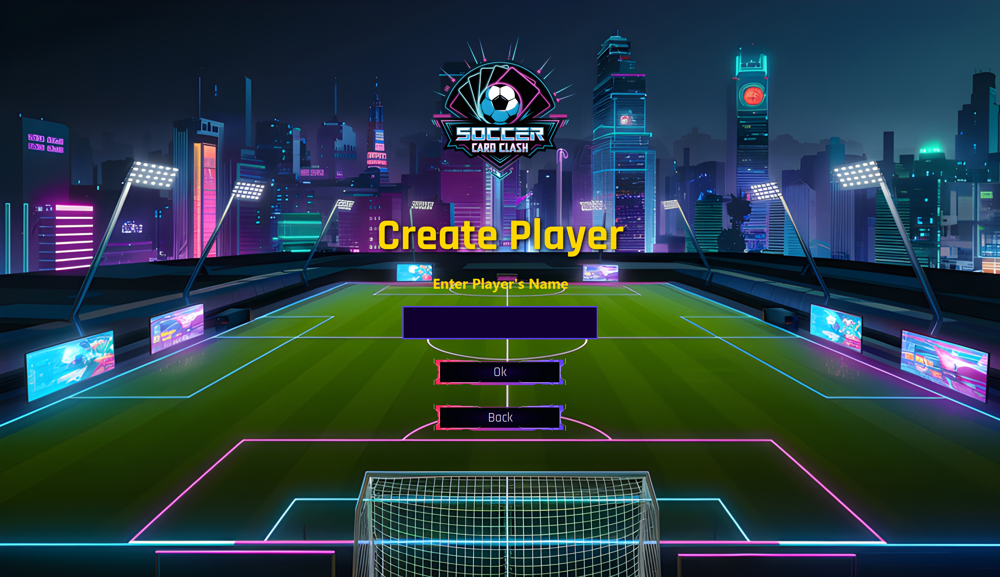
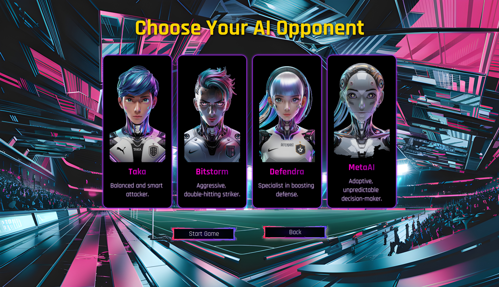
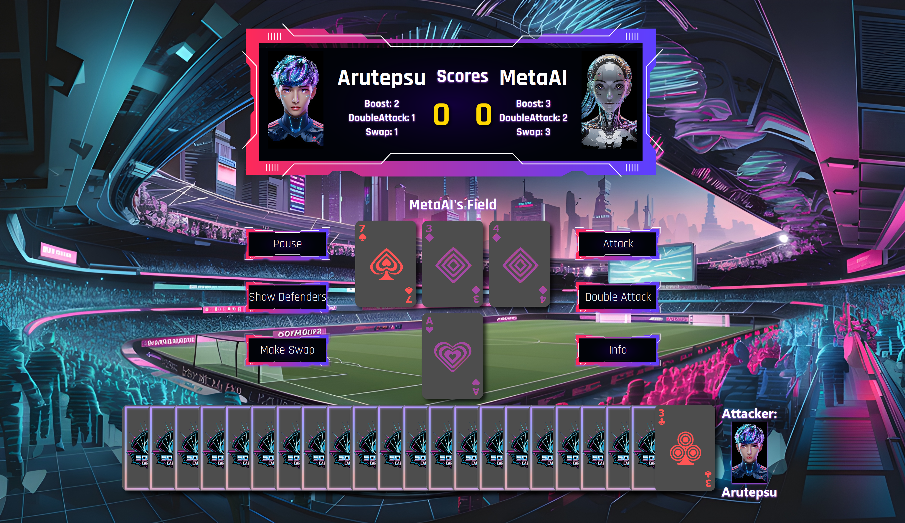
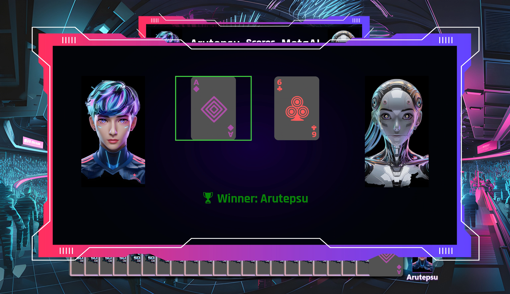
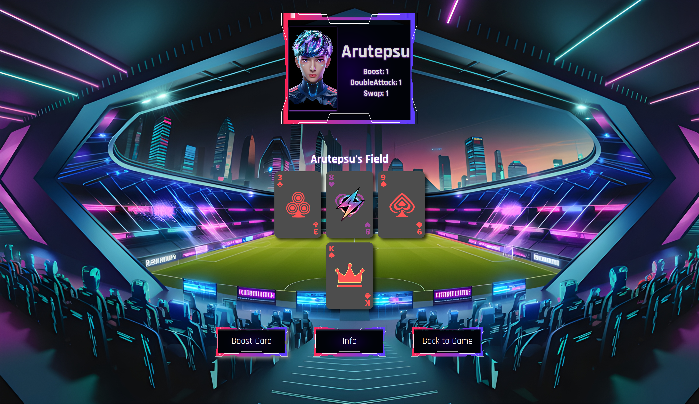
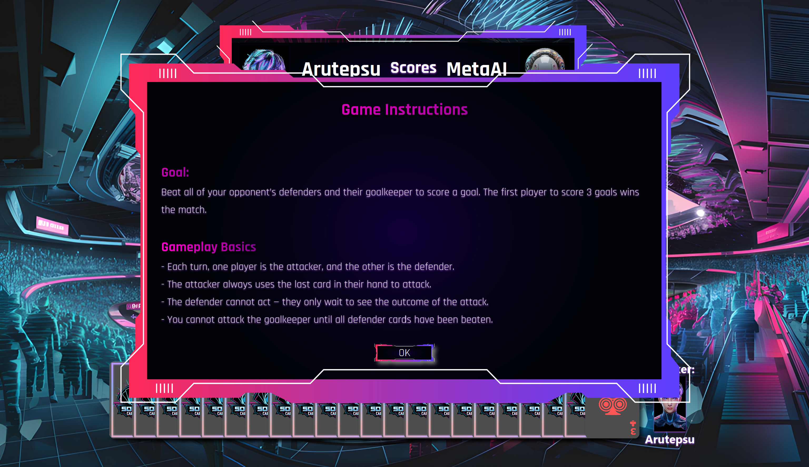
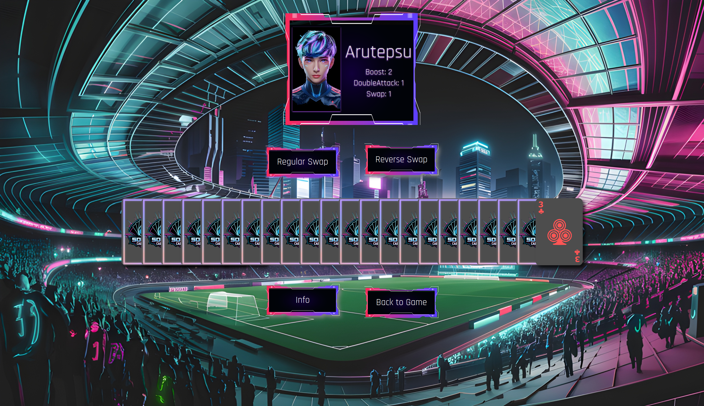
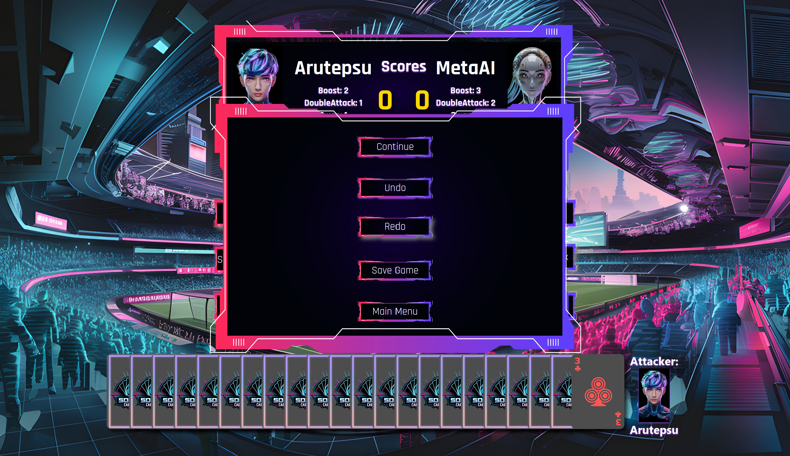

<p align="center">

</p>

---

# Soccer Card Clash

An unofficial web version of **Soccer Card Clash** developed for  
🌐 **Web Application** classes at **Konstanz University of Applied Sciences**.

<p align="center">
🌍 <strong>Project Domain:</strong>  
<a href="https://github.com/arutepsu/Soccer-Card-Clash">Soccer-Card-Clash</a>
</p>

* 🎮 Fast-paced 2-player card game where **soccer meets strategy**
* 🧠 Outsmart your opponent with attacks, boosts, and clever hand management
* 🌍 Play locally, against AI, or online with real players

---

## ⚽ Game Overview
* 🃏 Each player controls a hand of soccer-themed player cards
* 🔄 Players alternate between **attacker** and **defender**
* ⚔️ Use actions like **Attack**, **Boost**, **Swap**, and **Double Attack**
* 🥅 Score goals by defeating all defenders and the goalkeeper

### 📖 [Read Full Game Rules](docs/GAMERULES.md)

---

<h2 style="text-align: center;">▶️🎥 Demo Gameplay</h2>
<div style="display: flex; gap: 0px;">
  
  
</div>

---

## ⚙️ Server & Architecture

The backend is built using **🧩 Play Framework (Scala)** and follows a clean,  
**event-driven and server-authoritative architecture**.

### 🔧 Backend Responsibilities
* 🎮 Game logic & rule enforcement
* 🧑‍🤝‍🧑 Online matchmaking & session handling
* 🔐 Authentication & authorization
* 🔄 Real-time game state synchronization

---

### 📡 Communication Model

#### ⬆️ Commands (Client → Server)
Player actions such as **attack**, **boost**, **swap**, or **join game** are sent via:
* 🌍 **REST APIs**
* ⚡ **WebSockets** for low-latency interaction

#### ⬇️ Updates (Server → Client)
Game state updates are streamed using:
* 📣 **Server-Sent Events (SSE)**
* 🧵 Comet-style long-lived HTTP connections

This guarantees:
* 🔄 Real-time updates
* 📉 Low bandwidth usage
* 🧠 Deterministic, server-controlled gameplay

---

## 🔐 Authentication (Supabase)

Authentication is handled via **Supabase Auth**:

* 👤 User login via Supabase
* 🔑 Clients receive a **JWT bearer token**
* 🛂 Tokens are verified on every secured request
* 🔗 Online sessions are bound to authenticated users

This enables:
* 🤝 Secure online multiplayer
* 🔁 Session reconnects
* 📈 Future extensions (profiles, rankings, persistence)

---

## 🎮 Online Multiplayer

* 🆕 Create or join **online game sessions**
* 🆔 Each session has a unique **session ID**
* 👀 Spectators and reconnects are supported
* 🧠 The server is the **single source of truth**

---

## 🚆 Deployment (Railway)

The application is deployed on **Railway** using a **service-based architecture**.

### 🧩 Railway Services

* ⚙️ **Backend Service**
  * Play Framework (Scala)
  * Handles game logic, authentication, WebSockets, and SSE streams

* 🌐 **Frontend Service**
  * Standalone web application
  * Communicates with the backend via environment-configured URLs

* 🐘 **PostgreSQL Service**
  * Managed Railway PostgreSQL instance
  * Stores users, sessions, and persistent game data

### 🔐 Configuration

* Secrets and credentials are managed via **Railway environment variables**
* Each service is deployed and scaled independently
* Mirrors real-world production deployments

---

## ✨ Features

### 🤖 Singleplayer Mode
Play against AI opponents with unique playstyles and decision-making strategies.

### 🧠 Multiple AI Strategies
Defensive, aggressive, and hybrid AIs for varied gameplay.

### 🤝🌍 Online Multiplayer
Play real-time matches against friends or other players online.

### 🎨🌈 Cyberpunk Visual Style
Neon colors, futuristic UI, and smooth animations.

### ⚔️🃏 Strategic Depth
Smart use of **Swap**, **Boost**, and **Double Attack** decides victory.

---

## 📸 Screenshots










---

## 🧪💻 Run Locally

### ⚙️ Backend (Play Server)

```bash
sbt backend/run
```

### 🌐 Frontend (Webpack)

```bash
cd frontend
npm install
npm run build
npm run start
```